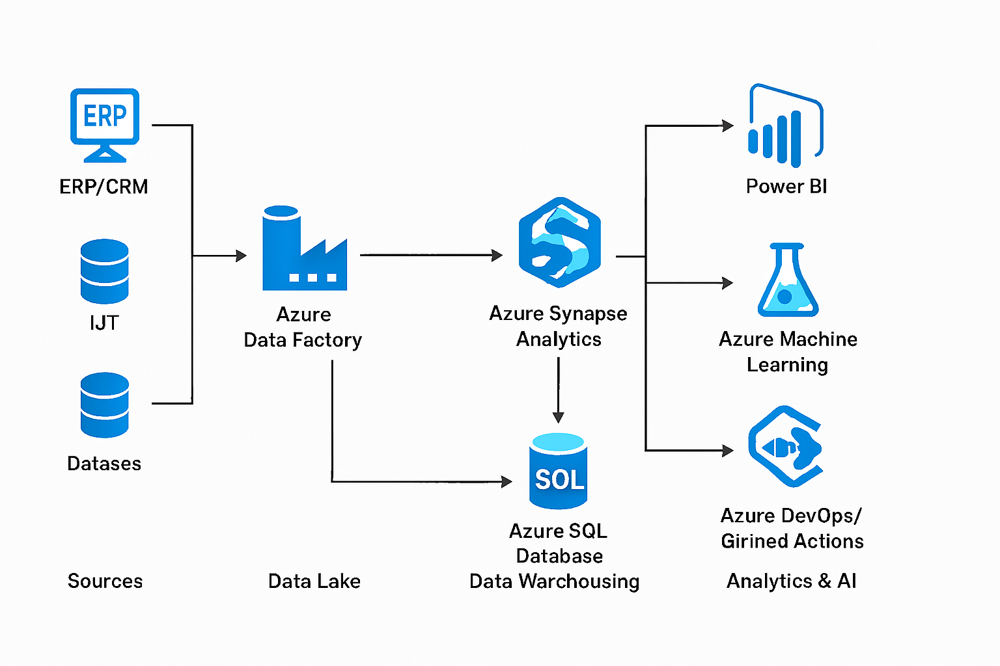

# 🌐 Cloud Data Architecture Project

## 📖 Overview
This project demonstrates the design and implementation of an enterprise-ready cloud data platform using **Azure Data Factory, Synapse Analytics, Azure SQL Database, and Azure Data Lake**. It covers the full lifecycle of data engineering: ingestion, storage, transformation, modelling, governance, and compliance.  

The goal is to showcase how a Cloud Data Architect builds scalable, secure, and analytics-ready solutions in the Azure ecosystem.

---

## 🏗️ Architecture


**Key Components:**
- **Azure Data Factory (ADF):** Orchestrates ETL/ELT pipelines.
- **Azure Data Lake:** Stores raw and curated datasets.
- **Azure Synapse Analytics:** Provides data warehousing and analytics.
- **Azure SQL Database:** Supports transactional workloads.
- **Azure DevOps/GitHub Actions:** Enables CI/CD automation.

---

## 📂 Repository Structure
- `01-architecture/` → Diagrams, standards, and documentation  
- `02-database/` → Database schemas, optimization scripts, security & DR playbooks  
- `03-data-modelling/` → Conceptual, logical, and physical models + metadata definitions  
- `04-cloud-engineering/` → ADF pipelines, CI/CD templates, monitoring scripts  
- `05-governance-compliance/` → Governance framework, compliance checklist, security practices  
- `06-ml-integration/` → Azure ML pipeline definitions and notebooks (stretch goal)  
- `07-migration/` → Migration strategy and scripts (stretch goal)  

---

## 🔄 Demo Flow
1. **Ingest** data from multiple sources using ADF pipelines.  
2. **Store** raw data in Azure Data Lake.  
3. **Transform & Load** into Synapse for analytics.  
4. **Model** data (conceptual, logical, physical) to support BI.  
5. **Analyze** with Power BI and Synapse.  
6. **Govern** with lineage, RBAC, and compliance frameworks.  

---

## 🛠️ Tech Stack
- **Data Integration:** Azure Data Factory (ADF)  
- **Data Storage:** Azure Data Lake, Azure SQL Database  
- **Data Warehousing:** Synapse Dedicated SQL Pool, Serverless Pool  
- **Data Modelling:** ER diagrams, star schema, metadata definitions  
- **Automation:** Azure DevOps, GitHub Actions (CI/CD)  
- **Governance:** Azure Purview, Security Center  
- **Stretch Goals:** Azure ML pipelines, enterprise migration strategy  

---

## ✅ Features
- End-to-end **cloud-native data architecture**  
- Optimized **database schemas** with indexing & partitioning  
- **ETL/ELT pipelines** with CI/CD automation  
- **Data governance framework** with compliance checklist  
- Optional **machine learning integration** for predictive analytics  
- Optional **migration strategy** for enterprise-scale projects  

---

## 🚀 Getting Started
1. Clone the repo:
   ```bash
   git clone https://github.com/Chaitanya150895/cloud-data-architecture-project.git
